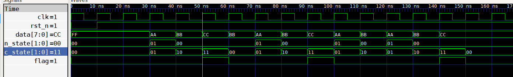

# Finite State Machine 有限状态机

有限状态机是表示多个状态及状态之间的跳转关系的数学模型。

数字电路中常用的有两种状态机，一种为米里（Mealy）型状态机，另一种为摩尔（Moore）型状态机。

## Mealy型状态机 & Moore型状态机

Mealy型状态机的结构如下图所示：


而Moore型状态机的结构如下：


对比来看，两者在电路结构上均由三部分构成：状态寄存器是核心，时序电路，表示当前状态。次态由输入和当前状态决定，组合电路。**唯一的区别在于产生输出的组合逻辑上，Moore型状态机的输出只由当前状态决定，而Mealy型状态机则由当前状态与当前的输入决定。**

>   米里型状态机比摩尔型状态机在某些情况下状态会更少，原因在于，米里型状态机可以将输入与状态结合起来当成输出，即（输入+现态）可以认为是一种新的*“状态”*。

## FPGA中的状态机

一般来说，在FPGA中状态机有多种写法，网上常见的有一段式、两段式和三段式状态机。

-   一段式状态机，就是将整个状态机写到一个always模块中去，这种情形用于简单的状态机的实现。

-   两段式状态机，将输入和状态跳转写到一个模块中，将输出写到另一个模块中。
-   三段式状态机，按照状态机的结构图来写，即输入部分，状态跳转部分和输出部分。

**原则上，三种形式的状态机，只要能实现相应的需求，那么该状态机就是没有问题的。即三种状态机只是在形式上不同，本质上是一样的。**而一段式与两段式没有三段式逻辑结构清晰，在比较复杂的状态机面前，显得有些烧脑（在构建状态机的时候会很复杂，逻辑杂糅到一起了）。这里重点介绍三段式状态机，三段式状态机按照数学模型来写，结构清晰，后期调试也相当方便。

## Task

输入为十六进制的序列，检测输入序列中是否存在`AABBCCH`。输入数据宽度为8位，输出1位标志位，当检测到输入端已经接收到`AABBCCH`后，输出一个周期的高脉冲。

### Moore型状态机

>   画状态转移图之前，首先得确定状态，Moore型状态机的输出完全由当前状态决定，那么可以根据当前状态来决定输出情况。

根据需求，可以确定出4个状态，分别是①其他状态，②检测到`AAH`，③检测到`BBH`，④检测到`CCH`，将四种状态分别命名为`idle,aa,bb,cc`，那么可以根据需求画出如下状态转移图。


假设输入序列为 ...**AABBCC**BB**AABBCC**AABB**AABBCC**CC...H，则输出应该有3个正脉冲。

#### FSM_Moore.v

```verilog
// 状态机完全按照数学模型来写，分为三段，将结构描述清楚即可
module FSM_Moore(           //  FSM_Moore fsm(
    input wire clk,         //      .clk  (   ),
    input wire rst_n,       //      .rst_n(   ),
    input wire [7:0] data,  //      .data (   ),
    output reg flag         //      .flag (   )
);                          //  );

// =====三段式状态机 Moore型===== //
reg [1:0] c_state,n_state;

localparam 
    idle  =  'b00,
    aa    =  'b01,
    bb    =  'b10,
    cc    =  'b11;

// 状态转移条件 次态组合电路
always @(*) begin
    //n_state = c_state ;//如果条件选项考虑不全，可以赋初值消除latch
    case(c_state)
        idle: begin
            if(data == 'haa) n_state = aa;
            else n_state = idle;
        end
        aa  : begin
            if(data == 'haa) n_state = aa;
            else if(data =='hbb) n_state = bb;
            else n_state = idle;
        end
        bb  : begin
            if(data == 'haa) n_state = aa;
            else if(data == 'hcc) n_state = cc;
            else n_state = idle;
        end
        cc  : begin
            if(data  ==  'haa) n_state = aa;
            else n_state = idle;
        end
        default: n_state  =  idle;
    endcase
end
// 状态转移 时序部分
always @(posedge clk or negedge rst_n) begin
    if(~rst_n) c_state <=  idle;
    else c_state <= n_state;
end

// 输出部分 组合电路
always @(*) begin
    if (c_state == cc) flag = 1'b1;
    else flag = 1'b0;
end
endmodule
```

#### tb.v

```verilog
`timescale 1ns/1ns
`define CLOCK_PERIOD 10
module tb();
reg clk;
reg rst_n;
always #(`CLOCK_PERIOD/2) clk<=~clk;

reg [7:0] data_i;
wire flag;

FSM_Moore fsm(
    .clk  (clk      ),
    .rst_n(rst_n    ),
    .data (data_i   ),
    .flag (flag     )
);

initial begin
    $dumpfile("./dumpfile.vcd");
    $dumpvars;
    clk<=1'b1;
    rst_n<=1'b0;
    data_i<='hff;
    #`CLOCK_PERIOD
    rst_n<=1'b1;
    #`CLOCK_PERIOD
    #`CLOCK_PERIOD data_i<='haa;
    #`CLOCK_PERIOD data_i<='hbb;
    #`CLOCK_PERIOD data_i<='hcc;
    #`CLOCK_PERIOD data_i<='hbb;
    #`CLOCK_PERIOD data_i<='haa;
    #`CLOCK_PERIOD data_i<='hbb;
    #`CLOCK_PERIOD data_i<='hcc;
    #`CLOCK_PERIOD data_i<='haa;
    #`CLOCK_PERIOD data_i<='hbb;
    #`CLOCK_PERIOD data_i<='haa;
    #`CLOCK_PERIOD data_i<='hbb;
    #`CLOCK_PERIOD data_i<='hcc;
    #`CLOCK_PERIOD data_i<='hcc;
    #(`CLOCK_PERIOD * 4)
    $finish;
end
endmodule
```

仿真得到的波形图如下所示：



>   注：
>
>   ①，这里输入序列为FF**AABBCC**BB**AABBCC**AABB**AABBCC**H序列，每当输入data变化时，产生n_state的组合逻辑就会发生变化，比如在30ns时刻，输入变为AAH，那么此时n_state立刻改变为01状态，然后c_state恰好遇到上升沿，即也变为01状态，c_state发生变化之后，n_state再次进行变化，此时的输入为AA，而状态是01状态，依然输出01。而下一个周期也是同样的道理，data变为bbh，改变了n_state，c_state跟随n_state变化，然后反过来又使得n_state变为了00。这也是为什么在后续只有00与01两个状态出现。
>
>   ②，在时钟上升沿来临时，理论上讲，如果输入恰好和延同时变化（严格对齐变化），那么状态机是不能采集到输入的。状态机的次态取决于上升沿来临前一小段时间，即在建立时间内的输入才决定次态是哪一个。比如在30ns处，理论上来讲，此刻c_state应该将30ns前一个小时刻n_state的值变为下一周期的值，也即00状态，然而这里直接变为了01状态。出现这种现象的原因是，一方面，没有静态时序约束，另一方面，计算机仿真的时候是理想的仿真，也即是不带实际电路信息的仿真。因此才会出现这种瞬间状态改变的情况。

### Mealy型状态机

将Moore型状态机转换为Mealy型状态机，可以去掉cc状态，然后得到如下的状态转化图。


输入序列不变，代码如下：

#### FSM_Mealy.v

```verilog
// 状态机完全按照数学模型来写，分为三段，将结构描述清楚即可
module FSM_Mealy(           //  FSM_Mealy fsm(
    input wire clk,         //      .clk  (   ),
    input wire rst_n,       //      .rst_n(   ),
    input wire [7:0] data,  //      .data (   ),
    output reg flag         //      .flag (   )
);                          //  );


// =====三段式状态机 Mealy型===== //
reg [1:0] c_state,n_state;

localparam 
    idle  =  'b00,
    aa    =  'b01,
    bb    =  'b10;

// 状态转移 时序部分
always @(posedge clk or negedge rst_n) begin
    if(~rst_n) c_state <=  idle;
    else c_state <= n_state;
end

// 状态转移条件 次态组合电路
always @(*) begin
    case(c_state)
        idle: begin
            if(data == 'haa) n_state = aa;
            else n_state = idle;
        end
        aa  : begin
            if(data == 'haa) n_state = aa;
            else if(data =='hbb) n_state = bb;
            else n_state = idle;
        end
        bb  : begin
            if(data == 'haa) n_state = aa;
            else if(data == 'hcc) n_state = idle;
            else n_state = idle;
        end
        default: n_state  =  idle;
    endcase
end

// 输出部分 组合电路
always @(*) begin
    if (c_state == bb && data == 'hcc ) flag = 1'b1;
    else flag = 1'b0;
end
endmodule
```

#### tb.v

```verilog
`timescale 1ns/1ns
`define CLOCK_PERIOD 10
module tb();

reg clk;
reg rst_n;
always #(`CLOCK_PERIOD/2) clk<=~clk;

reg [7:0] data_i;
wire flag;

FSM_Mealy fsm(
    .clk  (clk      ),
    .rst_n(rst_n    ),
    .data (data_i   ),
    .flag (flag     )
);

initial begin
    $dumpfile("./dumpfile.vcd");
    $dumpvars;
    clk<=1'b1;
    rst_n<=1'b0;
    data_i<='hff;
    #`CLOCK_PERIOD
    rst_n<=1'b1;
    #(`CLOCK_PERIOD + 1 ) // 这样写的目的是避免仿真过程中出现的过于理想的边沿变化情况
    #`CLOCK_PERIOD data_i<='haa;
    #`CLOCK_PERIOD data_i<='hbb;
    #`CLOCK_PERIOD data_i<='hcc;
    #`CLOCK_PERIOD data_i<='hbb;
    #`CLOCK_PERIOD data_i<='haa;
    #`CLOCK_PERIOD data_i<='hbb;
    #`CLOCK_PERIOD data_i<='hcc;
    #`CLOCK_PERIOD data_i<='haa;
    #`CLOCK_PERIOD data_i<='hbb;
    #`CLOCK_PERIOD data_i<='haa;
    #`CLOCK_PERIOD data_i<='hbb;
    #`CLOCK_PERIOD data_i<='hcc;
    #`CLOCK_PERIOD data_i<='hcc;
    #(`CLOCK_PERIOD * 4)
    $finish;
end
endmodule
```

仿真结果如下


可以发现，Mealy型状态机输出良好。

## 碎碎念

状态机本质上是对历史输入的一种记录，每个有效的输入信号，都会对状态机进行改变。

仿真过程中遇到的问题，比如是否携带电路信息等，这些可以通过实际的电路来进行验证，写测试的时候也应该注意，数据输入跳变时刻尽量不要与时钟边沿对齐，从而保证一定的鲁棒性。
