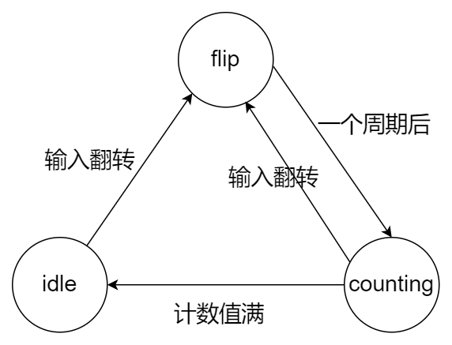
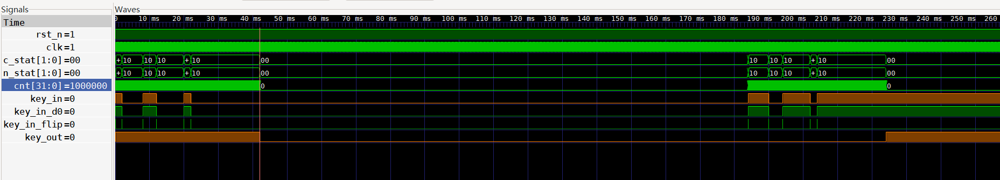

# 按键消抖

<p align="right">ZoroGH 2022/4/17</p>

## Intro

金属开关在按下的过程中，相互接触的两个金属弹片会由于振动而产生电路的抖动，从数字信号的角度来看，便是有许多毛刺的存在。如图所示。


（图片来源https://www.stepfpga.com/）

一般采用软件消抖的方式，一次按键过程中，抖动时间大概在10ms至20ms，于是，通过程序记录低电平时间即可确定是否按下按键，即达到了消抖的过程。


即通过软件延迟方式来进行消抖。

## 代码逻辑

当输入发生翻转时，计数器重置并开始计时，计时到设定值时认为输入稳定，此时将输出设置为输入即可。

定义3个状态：

- idle
- flip
- counting

状态转换图如下所示：



若当前状态为idle，则可将输入键转换为输出，否则输出一直保持之前的状态，即达到了延迟的效果。

## 代码实现

### Key_Debounce.v

```verilog
//  Key_Debounce kd (
//      .clk     (      ),
//      .rst_n   (      ),
//      .key_in  (      ),
//      .key_out (      )
//  );


module Key_Debounce (
    input       clk         ,
    input       rst_n       ,
    input       key_in      ,
    output reg  key_out
);

parameter N = 32 ;           // debounce timer bitwidth
parameter FREQ = 50;         // model clock :Mhz
parameter MAX_TIME = 20;     // ms
localparam TIMER_MAX_VAL =   MAX_TIME * 1000 * FREQ  - 1 ; // 计数值最大值
/* 
    输入时钟频率为 50MHz，延迟时间为20ms
    则计数器应该记录的最大值便是 50MHz * 20ms = 1000 * 1000 次
    需要20bit的计数器。
 */

reg key_in_d0;//锁存一拍
wire key_in_flip;
always @(posedge clk or negedge rst_n) begin
    if(~rst_n) begin
        key_in_d0 <= 1'b1;
    end
    else begin
        key_in_d0 <= key_in;
    end
end
assign key_in_flip = key_in ^ key_in_d0;


reg [N-1:0] cnt;
reg [1:0] c_stat;
reg [1:0] n_stat;
localparam idle     = 2'b0;
localparam flip     = 2'b1;
localparam counting = 2'd2;

// c_stat & n_stat
always @(posedge clk or negedge rst_n) begin
	if(~rst_n)
		c_stat<=1'b0;
	else
		c_stat<=n_stat;
end
// status changing 
always@(*) begin
	case(c_stat)
        idle: begin
            n_stat = (key_in_flip==1'b1) ? flip : idle ;
        end
        flip: begin
            n_stat = (key_in_flip==1'b1) ? flip : counting ;
        end
        counting : begin
            if (key_in_flip == 1'b1) begin
                n_stat = flip;
            end
            else if (cnt == TIMER_MAX_VAL)
                n_stat = idle;
            else 
                n_stat = counting;
        end
    endcase
end

// 计数器控制
always @(posedge clk or negedge rst_n) begin
    if(~rst_n)begin
        cnt<='b0;
    end
    else begin
        case (c_stat)
            idle     : cnt <= 'b0       ;
            flip     : cnt <= 'b0       ;
            counting : cnt <=  cnt+1'b1 ;
        endcase
    end
end

always @(posedge clk or negedge rst_n) begin
    if (~rst_n) begin // 默认情况下 输入会和输出相同
        key_out <= key_in;
    end
    else begin
        if (cnt == TIMER_MAX_VAL)// 只有当状态稳定时，输出才会变化
            key_out <= key_in;
    end
end 

endmodule
```

### tb.v

```verilog
`timescale 10ns/10ns
`define CLK_PEROID 2 // 50Mhz 时钟

module tb();
reg clk;
reg rst_n;
reg key_in;
wire key_out;
always #(`CLK_PEROID/2) clk <= ~clk;

Key_Debounce kd (
	.clk     (clk       ),
	.rst_n   (rst_n     ),
	.key_in  (key_in    ),
	.key_out (key_out   )
);

initial begin
	$dumpfile("./dumpfile.vcd");
	$dumpvars;
	clk<=1'b1;
	rst_n <= 1'b0;
	key_in<=1'b1;
	#`CLK_PEROID
	rst_n <= 1'b1;
	#(`CLK_PEROID/2)
	#(`CLK_PEROID*3)	key_in <= 1'b0;
	#(`CLK_PEROID*2)	key_in <= 1'b1;
	#(`CLK_PEROID*100)	key_in <= 1'b0;
	#(`CLK_PEROID*30)	key_in <= 1'b1;
	#(`CLK_PEROID*3)	key_in <= 1'b0;
	#(`CLK_PEROID*1)	key_in <= 1'b1;


	#(`CLK_PEROID*100000)    	key_in <= 1'b0;
	#(`CLK_PEROID*300000)    	key_in <= 1'b1;
	#(`CLK_PEROID*200000)    	key_in <= 1'b0;
	#(`CLK_PEROID*400000)    	key_in <= 1'b1;
	#(`CLK_PEROID*100000)    	key_in <= 1'b0;

	#(`CLK_PEROID*1000*1000*4)
	#(`CLK_PEROID*1000*1000*4)

	#(`CLK_PEROID*100000)       key_in <= 1'b1;
	#(`CLK_PEROID*300000)       key_in <= 1'b0;
	#(`CLK_PEROID*200000)       key_in <= 1'b1;
	#(`CLK_PEROID*400000)       key_in <= 1'b0;
	#(`CLK_PEROID*100000)       key_in <= 1'b1;
	#(`CLK_PEROID*1000)         key_in <= 1'b0;
	#(`CLK_PEROID*1000)         key_in <= 1'b1;
	#(`CLK_PEROID*500)          key_in <= 1'b0;
	#(`CLK_PEROID*5)            key_in <= 1'b1;
	#(`CLK_PEROID*50)           key_in <= 1'b0;
	#(`CLK_PEROID*1)            key_in <= 1'b1;
	#(`CLK_PEROID*1000*1000*4)
	$finish;
end
endmodule


```

## 仿真结果




## Reference

- [小脚丫](https://www.stepfpga.com/doc/7._%E6%8C%89%E9%94%AE%E6%B6%88%E6%8A%96?s[]=%E6%8C%89%E9%94%AE%E6%B6%88%E6%8A%96)
- [百度：按键消抖](https://baike.baidu.com/item/%E6%8C%89%E9%94%AE%E6%B6%88%E6%8A%96/1566537?fr=aladdin)
